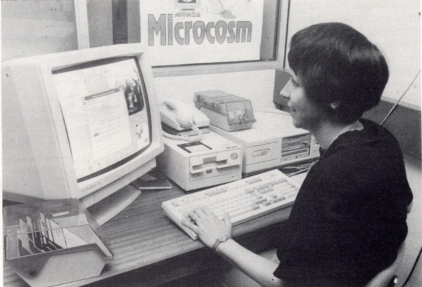
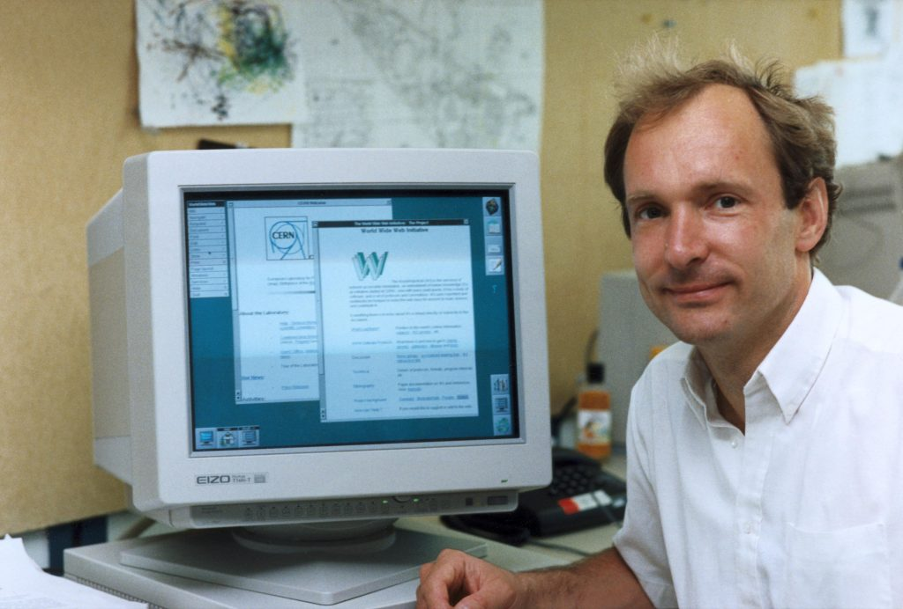
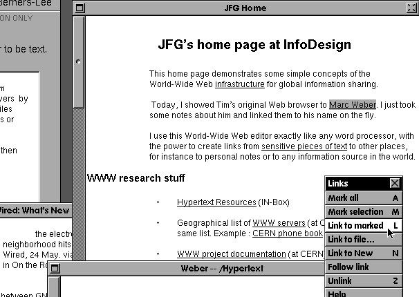
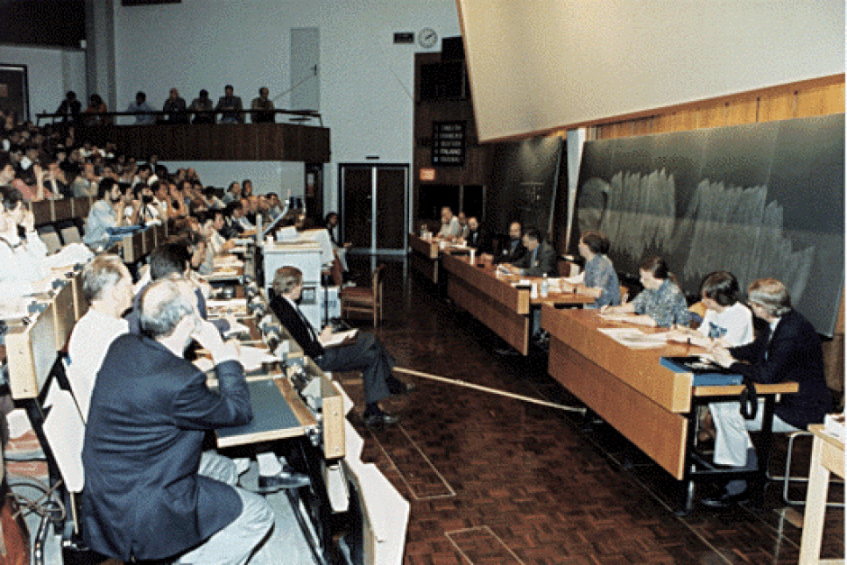

**перевод статьи [First Things First, What is the Web? - The History of the Web](https://thehistoryoftheweb.com/complete-history/first-things-first-what-is-the-web/)**

Что такое Всемирная Паутина (World Wide Web, далее в тексте «Веб»)? Вроде бы легко. Это Единообразный указатель ресурса (URL, Uniform Resource Locator), Протокол передачи гипертекста (HTTP, Hypertext Transfer Protocol) и Язык разметки гипертекста (HTML, Hypertext Markup Language). Три акронима, соединенных в распределенную сеть из серверов и клиентов, так чтобы мы могли смотреть *видосы* с котиками, проверять электронную почту, читать новости и постить картинки еды, которую вот-вот съедим или только что съели, а также куча всего другого.

Это всё. Спасибо за прочтение! Можно расходиться. 

А как же подробности? Согласен, давайте углубимся в тему. Веб составляют множество технологий, только часть из которых создавалась исключительно под его нужды, но которые благодаря нововведениям и инновационным идеям расширились до планетарного масштаба. Тим Бернерс-Ли (Tim Berners-Lee), создатель Всемирной паутины, трансформировал некоторые великолепные идеи того времени в нечто удивительное, распределенное и полностью свободное. Веб принял знакомый нам вид, когда Тим поместил усовершенствованный гипертекст в глобальную сеть Интернет. Получилось нечто настолько простое, что находились те, кто считал детище Тима бесполезным. Несмотря на это, через несколько лет технология захватила мир.

## 1. Гипертекст: Двери в цифровой мир.
Если вы попробуете «заглянуть под капот» глобальной сети Интернет и покопаться там, то обнаружите технологию гипертекста: концепт, который одинаково тяжело объяснить и представить до эры компьютеров, хотя первые прототипы гипертекста моложе их по крайней мере на век. Поэтому дабы разобраться в вопросе, важно знать, с чего начать.

Можно начать, к примеру, с легендарной демонстрации технологий Дугласом Енгельбартом (Douglas Engelbart) в 1968 году, получившей название «The Mother of All Demoes», на которой общественности впервые были представлены гиперссылки (прим. переводчика: а также компьютерная мышь, электронная почта и видеоконференции). Или еще раньше, с конца Второй мировой войны, когда Alex Wright написал статью [The Secret History of Hypertext](https://www.theatlantic.com/technology/archive/2014/05/in-search-of-the-proto-memex/371385/), а Vanneaver Bush [воображал способ для хранения](https://www.theatlantic.com/magazine/archive/1945/07/as-we-may-think/303881/) и связывания всего человеческого знания в продуманную коллекцию мини-клипов. Похожие на гипертекст идеи также можно обнаружить в художественной литературе, к примеру, в произведениях Томаса Пинчона (Thomas Pynchon) и Джорджа Луиса Боргеса (Jorge Luis Borges).

*«Сад, расходящихся дорожек» Джорджа Луиса Боргеса считается ранним предшественником гипертекста.*

Начнем все же с чего-то незамысловатого. Со ссылки. Ссылки есть на всех сайтах. Безусловно, вы с ними знакомы, если хотя бы раз пользовались интернетом. Всем известны подчеркнутые слова синего цвета, при нажатии на которые вы переходите на другой сайт ([как, например, эта ссылка на определение гипертекста в Wikipedia](https://en.wikipedia.org/wiki/Hypertext)). Это, однако, урезанная в функционале версия гиперссылки и, соответственно, гипертекста.

Гипертекст, по существу, это связанный текст. Термин в 1968 году впервые ввел Тед Нельсон (Ted Nelson) во время разработки механизма индексации и складировании разветвленных путей человеческого разума. Нельсон отметил, что люди придают большое значение связям между объектами для ранжирования их важности и лучшего запоминания. Разноцветные наклейки на мониторе, ориентация продуктов в холодильнике, порядок книг в шкафу – всё это невидимые знаки, которые хранят некий смысл, сознаете вы это или нет. Гипертекст должен был привнести похожие концепции в цифровой мир.

Итак, гипертекст описывает документы (или медиа), имеющие непосредственную связь с другими документами. Эта связь и создает ту информационную ценность, которую не имеют отдельно взятые текста.

С практической точки зрения это означает, что вы можете, используя некоторую программу, напечатать текст, затем напечатать другой текст, ссылаясь на первый, то есть дав команду компьютеру связать их. Это позволит вам с легкостью переходить от одного текста к другому и обратно. Понятно, что это можно продолжать, и в сложной системе, к примеру, разделять текста по секциям, создавать связанные списки для удобного изучения истории Греции или помощи коллегам в слежении за созвездиями.

Хочу отметить, что в свое время программы, использующие гипертекст были самыми инновационными. К середине 80-х сообщество вокруг этой технологии напоминало улей, в котором разработчики претворяли идеи гипертекста во всё более совершенные программы. Увидели свет приложения и инструменты для исследователей, ученых и даже для персональных компьютеров; все они позволяли организовывать данные в желаемом виде. А в каждой исследовательской лаборатории упорно трудились для дальнейшей адаптации технологии. Общими усилиями им удалось создать совершенно новые парадигмы программного обеспечения и, связанных с его созданием процессов и понятий, которые кажутся бесконечно знакомыми сегодня, но которые считались невозможными всего за несколько лет до этого.

Приведу пример нескольких интересных программ того времени.

Сразу после того, Тед Нельсон ввёл термин «гипертекст», Norman Meyrowitz, Nancy Garrett, и Karen Catlin из университета Брауна вдохнули жизнь в гиперссылки, адаптировав их для своей новой программы Intermedia.  Janet Walker из компании Symbolics была одержима идеей сохранения ссылок для быстрого их нахождения в будущем – своего рода книжной закладки. Ben Schneiderman из университета в Мэриленде собирался использовать гиперссылки для своего проекта крупнейшего источника информации Interactive Encyclopedia System.

Стоит также упомянуть программу Microcosm и ее создательницу Dame Wendy Hall. Основной идей Microcosm было то, что ссылки, созданные пользователем, хранились в отдельной базе данных, специально разработанной для удобного хранения метаданных о соединениях. В такой реализации ссылки никуда не пропадали даже при разделении текстов, они просто указывали на другое место. Была даже возможность писать аннотации к ссылкам, объясняющие, почему это соединение важно. Таким образом, Wendy Hall удалось создать программу, позволяющую добавлять над документом отдельные слои ссылок, одни из которых были бы полезны, к примеру, экспертам, а другие обычным читателям.

*Dame Wendy Hall за работой над Microcosm, одной из самых инновационных программ того времени*

Почтовые рассылки, конференции и большое комьюнити, одновременно с дружелюбными и соперническими настроениями – все это было похоже на гонку вооружений с целью создать следующую программу, которая «взорвёт». Практически каждый разработчик так или иначе имел отношение к работе с гипертекстом. Благодаря такой «гонке» цифровой мир стал более сложным, экспансивным и всеобъемлющим.

Затем в бой пошла тяжелая артиллерия. Apple, вдохновлённая детищем компании Xerox PARC, программой NoteCards, представила свое гипертекстовое приложение Hypercard, которое распространялось вместе с операционной системой Mac. Приложение позволяло создавать карточки с любым содержимым и связывать их, используя визуальный интерфейс.

К концу 80-ых, всем было ясно, что у технологии светлое будущее.

## 2. Обещания Xanadu
Здесь мне хотелось бы сделать паузу и вернуться к Теду Нельсону. Человек, который ввёл термин «гипертекст», не был программистом. Он был человеком идей, и все его идеи, как сейчас кажется, сливались в проект Xanadu, проект которому была посвящена вся его карьера. Самую полную историю Xanadu можно узнать из статьи для Wired от Гари Вулфа [Проклятье Xanadu](https://www.wired.com/1995/06/xanadu/). Историю, которая следит за проектом, с момента когда разработчики переезжают из университета сперва в дом Нельсона, а через какое-то время становятся частью одной из самых больших компаний-производителей программного обеспечения Autodesk. История, настолько большим количеством драматических взлетов и падений, а также скрытой борьбы и огромных инвестиций, что, непосредственно, о гипертексте редко вспоминают, когда говорят о Xanadu. Вулф пишите [о Xanadu]: «Самый продолжительный фантомный проект в истории программирования – 30-ти летняя сага о бешеном прототипирование и душераздирающем отчаянии». К слову, статья написана в 1995 году, а Xanadu до сих пор в полуактивной разработке.

Нет, мы рассматриваем Теда Нельсона и Xanadu, не за внушительный вклад в комьюнити вокруг гипертекста. Тут были другие компании и программы, делавшие технологию доступной для общественности. Xanadu же важна благодаря своим идеям.

Нельсон верил, что человеческий разум может быть картографирован. Не с помощью кружков и стрелок, как это делают современные *mind-map* программы, а с использованием замысловатых кружев ссылок и документов, соединенных доселе неизвестным способом. Нельсон был покорен концептом создаваемой программы. Он предполагал, что Xanadu будет содержать информацию о любой теме, о которой вообще можно подумать, своего рода Wikipedia с ещё большим погружением. Также частью программы должна была стать сеть перекрестных ссылок, содержащих информацию о связанности отдельных тем.

Вулф назвал Xanadu проклятьем, но мне кажется, что в то же время она была обещанием. Она должна была стать самой впечатляющей реализацией возможностей гипертекста. Индексированный и связанный массив человеческих знаний, с возможностью повторения процессов, происходящих в нашем мозге. Но даже сейчас нет ни одной программы, сравнимой по возможностям с маленьким прототипом предполагаемой Xanadu.

В интервью для BBC [Нельсон сказал об Интернете так](http://news.bbc.co.uk/2/hi/science/nature/1581891.stm):
> Он невероятно успешен. Он тривиально прост. Невероятно успешен, подобно караоке – простой, но любимый всеми.  

Главному детищу Теда Нельсона, сложнейшей по своей задумке и практически невыполнимой для реализации, программе Xanadu не суждено было состязаться с вебом. Сложность – противник идей. Если вы хотите соединить мир, вы должны думать просто. Как это сделал Бернерс-Ли, прародитель того, что сегодня мы называем Всемирной паутиной.

## 3. Веб и гипертекст
Я поведал вам обо всем этом без упоминания веба, с целью познакомить вас с миром, еще до его появления. Мне кажется, что существуют люди, считающие веб некой магией, которая существовала всегда и относительно недавно содрогнула мир и возвестила о приходе информационной эры. В реальности же все наоборот. Первые годы веб  находился в зачаточном состоянии по сравнению с технологией гипертекста, и его никак нельзя было назвать «Всемирная паутиной».

Эта история возможно вам известна – [я о ней уже писал](https://thehistoryoftheweb.com/web-first-and-second-browser/) – Тим Бернерс-Ли (Tim Berners-Lee) трудился в CERN, исследовательской лаборатории, известной широкой публике благодаря высокоэнергетической физике и Большому Адронному Коллайдеру, когда с помощью пары корпоративных уловок ему удалось выбить финансирование для многообещающей программы, которая должна была упорядочить все записи сотрудников лаборатории. Но у Тима с самого начала были другие планы, он собирался создать систему чтения/записи для Интернета, которая позволила бы беспрепятственное распространение информации по проводам глобальной сети.

**Тим Бернерс-Ли за компьютером NeXT, который он использовал для разработки веба.*

Перед одержимым этой идеей Тимом стояла задача определиться со стандартным путем не только описания документов, но и связывания их друг с другом. Что, конечно же, возвращает нас к гипертексту. Для себя инженер решил, что проект, которому суждено было стать Всемирной Паутиной (World Wide Web), будет использовать элементарный язык для описания документов. Им был разработан язык разметки, являющийся смесью гипертекста и SGML, самодостаточного языка разметки для цифровых документов и кроссплатформенных принтеров. Язык получил название «Гипертекстовый язык разметки» (HyperText Markup Language), или HTML.

HTML, по сути, это коллекция из строительных блоков, создающая структурированные документы, сегодня называемые веб-страницами. В первых версиях этого языка были доступны заголовки, параграфы, списки и т. д., и соответствующие им тэги (к примеру `<h1>`, `<ul>`). И, конечно же, была представлена ссылка (`<a href=«#">Link</a>`) , та самая гиперссылка, речь о которой шла выше и с которой в скором времени будет ассоциироваться весь веб. Но об этом позже.

Как отмечает Клэр Эванс (Claire Evans) в своей книге [Broad Band: The Untold Story of the Women Who Made the Internet](https://www.amazon.com/Broad-Band-Untold-Story-Internet/dp/0735211752), HTML и веб не так много сделали для сообщества гипертекста в целом. Концепция сети во время зарождения была отнюдь не передовой. Ссылки были односторонними и неразрывно связывались с родительским документом. К тому же, если документ, являвшийся направлением ссылки, удалялся, то эта ссылка становилась бесхозной и оставалась гнить. Прибавьте к этому отсутствие определенной структуры, иерархии и централизованной системы контроля. Были лишь односторонние ссылки, указывающие на что угодно.

Дела многообещающего проекта Бернерса-Ли были настолько плохи, что ему даже отказали в докладе на конференции Hypertext в 1991 году. Бернерс-Ли решил направиться туда в любом случае, заодно прихватив с собой компьютер. Но на самой конференции не оказалось должного доступа к Интернету, и ему пришлось демонстрировать возможности HTML в вакууме, без сети. 

Бернерс-Ли ставил целью своей презентацией убедить бывалых разработчиков гипертекста, что веб это платформа достойная их внимания. Но все, что они видели – это простейшая гипертекстовая система, запущенная на дорогущем компьютере NeXT и не имевшая привычных пионерам области функций. В то время разработчики пользовались технологией FTP для передачи и загрузки ПО на компьютеры и уже создавали по-настоящему революционные программы.

Было сложно разглядеть в вебе не программу, а платформу для них. Платформу с очень простой архитектурой, которую совсем не обязательно загружать на NeXT. На самом деле ее вообще никуда не надо было загружать. Она полностью жила в Интернете. Каждый мог создать веб-сайт с полезной информацией или же просто с битыми ссылками. Но самое важное, ссылки могли указывать на любой другой веб-сайт. Никто никого не контролировал. Бернерс-Ли задумывал систему, созданную и построенную энтузиастами на базе новейших технологий.

Во время конференции разработчик начал раздавать код, который он использовал для генерации HTML, а также код для протокола HTTP, который сплетал веб и Интернет. Эта связь и вдохнула жизнь в детище Тима Бернерса-Ли.

## 4. Web теперь в онлайне.
Операционные системы (ОС) являлись своеобразными барьерами для тогдашних программ. ЦЕРН был наполнен исследователями, использующими разные компьютеры, программы и операционные системы. Когда такие программы, как Microcosm или NoteCard представлялись публике, разработчикам также приходилось собирать их отдельно под Windows, Mac и Linux. Бернерс-Ли хотел создать унифицированную платформу.

Дело в том, что компьютеры на разных ОС плохо коммуницируют между собой. Была необходимость создать протокол передачи данных, благодаря которому компьютеры «разговаривали» бы друг с другом. От протокола также требовалась простота, гарантия направленности сообщений, избыточность, обработка ошибок и универсальность. Компьютер, использующий этот протокол, должен был иметь возможность выступать как передатчиком, так и получателем. Все эти задачи элегантным образом решил HTTP.

HTTP, протокол передачи гипертекста, построен поверх Интернета и используется для обмена файлами между компьютерами. Одни из них, серверы, транслируют контент веб-страниц. Другие же, так называемые  клиенты, сперва запрашивают веб-страницы у сервера, а затем выводят их на экраны мониторов. HTTP подобен клею; с помощью него Бернерс-Ли сумел объединить разные компьютеры на разных ОС в масштабную, распределенную сеть.

Стоит отметить, что кроме стандартизации HTTP мало что добавил поверх протокола TCP/IP, который в то время преобладал в области обмена информацией. Новый протокол даже что-то убрал из предшественника. Клиент, к примеру, тот же браузер, с которого вы читаете эту статью, может делать запросы лишь из определенного набора, причем только один за раз. `GET`  для запроса страницы, `PUT` для вставки документа в веб, а `DELETE` вовсе удаления страницы. В свою очередь, сервер сам решает, как ему реагировать и отвечать на запросы. По завершению операции, он вернет клиенту некий контент или информацию. Зачастую это уже готовые веб-страницы, но ответ может ничего и не содержать.

*Первый веб браузер, разработанный в ЦЕРНе.*

Это все, что нужно сделать. Так работает процесс отправки и получения веб-страниц в Интернете.

Сам по себе протокол HTTP не имеет состояния (англ. *stateless*). Можно понимать это так, что HTTP беспамятный, а по существу «тупой». На каждый запрос клиента, сервер сформирует ответ, причем у сервера нет возможности ни запомнить, ни сохранить информацию для будущих запросов. Браузер попросит, «Дай мне эту страницу», а сервер ответит, «Держи, вот она». Следующий раз процесс повторится с чистого листа и в полном объёме.

Протокол FTP, в свою очередь, имеет состояние. Один раз установив соединение, он использует его для множества запросов обмена файлами. FTP невероятно надежный и практически не имеет ограничений пропускной способности.

Почему же реализация HTTP – кожа да кости? С какой целью давать ему беспамятный мозг? Это позволило привнести в веб две вещи, которых не хватало в других протоколах: скорость и приспосабливаемость. От веба требовалось загружать страницы за миллисекунды. Удаление хлама из HTTP, позволило делать запросы быстро, даже во времена, когда информация передавалась по кабелям телефонной сети. Тот факт, что остались лишь несколько предопределённых типов запросов, делало протокол симпатичным для изучения, ведь разработчик, знакомый с технологиями Интернета, мог за вечер написать сервер или клиент. Если вы придерживались правил, на которых базировался протокол, он отвечал на все ваши нужды. А это  невероятно важно, если вы планируете распространять платформу бесплатно. Но кажется я немного спешу.

Реализации HTML и HTTP были подобны упражнениям в сдержанности. На поверхности они ощущались малополезными. Но главное, они заложили основу для веба, тонкого слоя абстракции, построенного поверх Интернета. Предполагал ли Бернерс-Ли, что в будущем мы используем эту основу и построим совершенно новый мир? Многие и близко не предполагали подобного.

## 5. Как найти нужное?
Ценность всех этих замечательных технологий была бы довольно скудной для конечных пользователей, если бы они не нашли нужное, добравшись, наконец, до веба. Дабы указать направление браузерам, Тиму Бернерсу-Ли очередной раз, не устану это повторять для последующих поколений, необходимо было найти простое решение.

Вот из такой необходимости появился «Единообразный указатель ресурса», или URL. Спецификация, в первом своем релизе уместившаяся на одной странице. Механизм, о которой Бернерс-Ли неоднократно заявлял общественности, является важнейшей частью Всемирной паутины.

По сути, это адрес, не случайно ведь, словосочетание «веб-адрес» и означает URL. Комбинация слов и слэшей («/»), говорящая браузеру, какую страницу мы хотим увидеть.

Но думаю, понятно, что эта комбинация не случайна сгенерирована. Формат URL довольно предсказуем и построен так, чтобы вы могли по памяти воспроизводить тот или иной адрес. Скорее всего вы об этом не задумывались, но URL следует нескольким соглашениям, каждое из которых было принято еще до эпохи веба. Бернерс-Ли вежливо позаимствовал их из процессов самого Интернета. Итак, веб-адрес состоит из доменного имени (`tinychief.ru`), пути до необходимого ресурса (`/blog/3/history-of-web`), и названия протокола (`https://`).

Мог ли Бернерс-Ли изобрести собственную схему адресации? Да, мог, но не стал. Его решением было остановиться на лучших практиках и соглашениях, с которыми разработчики уже были хорошо знакомы. Таким образом URL заставил обратить внимание на платформу веб не только тех, для кого она разрабатывалась, но и тех, кто до этого её ни раз не видели. 

Также механизм получился гибким, с возможностью дальнейших доработок. Привычная часть в начале: `http://` или `https://`, может быть чем угодно. Например, если браузер решит, что хочет поддерживать протокол FTP, то она может быть заменена на `ftp://`. Браузеры не обязательно должны быть ограничены лишь Глобальной паутиной. Продолжительное время наравне с Web соперничал Gopher, а адреса начинались с `gopher://`. К тому же ссылки могут как указывать на веб-страницы, так и соединять с другими протоколами Интернета. Сервер сам решает, как обойтись с тем или иным запросом, содержащим путь до файла, часть после доменного имени. Таким образом, хотя URL и содержит множество согласованных лучших практик, разработчики вольны делать, что захотят.

Это дало создателям браузеров и веб-разработчикам выбор. Бернерс-Ли сперва хотел назвать механизм *Универсальным* указателем ресурса (*Universal* Resource Locator). Но после нескольких дискуссионных собраний остановились на *Единообразном* (*Uniform*), что как раз таки говорит о намерениях URL дать общепринятый адрес для всех интернет ресурсов.

C приходом URL все изменилось. Он замкнул цикл гипертекста; теперь каждая страница Всемирной паутины имеет единственный адрес, на который вы можете ссылаться. Перед людьми открылась возможность заиметь уникальный уголок в интернете и назвать его по желанию (прим. переводчика: как, например, этот сайт по адресу tinychief.ru; с удовольствием расскажу историю выбора названия в личной переписке!).

## 6. Отдавая все это.
Здесь нас ждет поворот сюжета. Часть истории, поменявшей все. Причина, по которой Бернерс-Ли выбрал многосторонность системы нежели сложность.

С первого дня платформа была бесплатной. Спустя пару лет, команда разработчиков веба из ЦЕРН убедила начальство сделать его общедоступным. Это означало, что им никто не владеет. Любой желающий вправе пользоваться вебом и создавать программы поверх него. Дабы создать веб-сайт, вам не нужно разрешение, которые требуются для регистрации приложений в магазине приложений или страниц в социальных сетях.

*Первая международная конференция, посвященная веб. Женева, 1994 год.*

К моменту релиза платформа была настолько маленькой, что полностью умещалась на дискете. Только представьте, Глобальная паутина на дискете. Во время поездок на конференции Бернерс-Ли раздавал эти дискеты, а в каждом электронном письме обязательно вставлял ссылку на скачивание веба.

Факт того, что платформу сделали открытой, стал ее последней великой инновацией. По этой причине люди стали тяготиться именно к ней, хотя на рынке были более продвинутые альтернативы. Работая в ЦЕРН’е, Бернерс-Ли дал достойную опору молодой платформе, и уже через несколько лет люди создавали новые фунцкии и приложения, о которых он даже и не мечтал. Следующий шаг веба – выход за пределы коридоров лаборатории навстречу огромному сообществу разработчиков, очень точно соответствует его природе открытости. Но эта история для следующей статьи.

