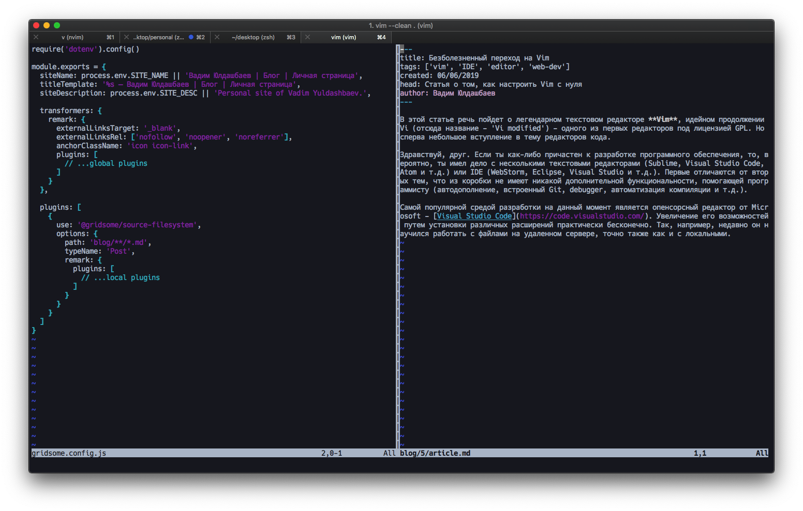
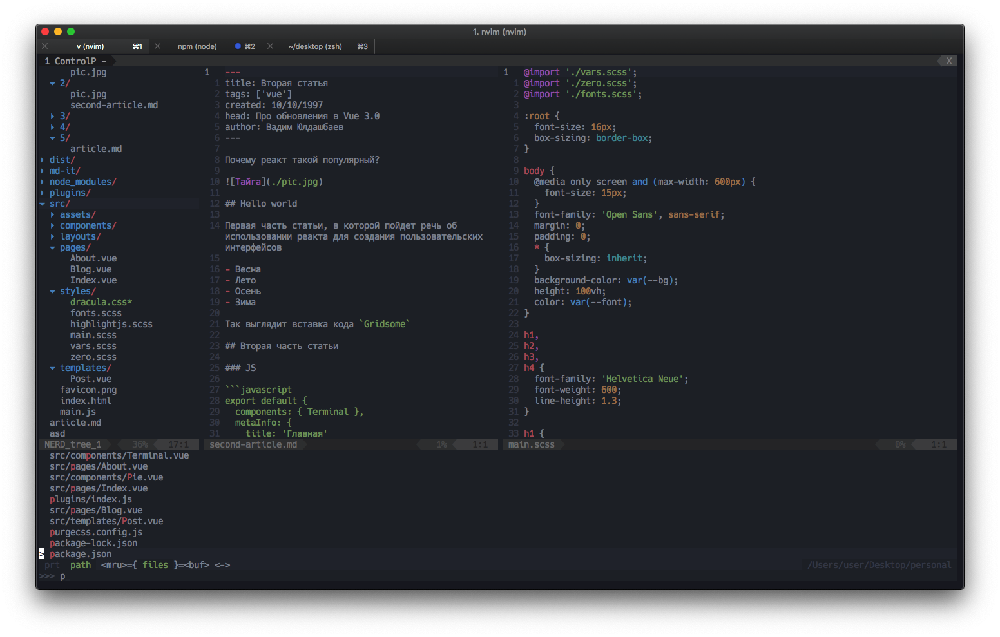

В этой статье речь пойдет о текстовом редакторе **Vim**, идейном продолжении Vi (отсюда название – 'Vi modified') – одного из первых редакторов под лицензией GPL. Но сперва небольшое вступление в тему редакторов кода.

Здравствуй, друг. Если ты как-либо причастен к разработке программного обеспечения, то, вероятно, имел дело с несколькими текстовыми редакторами (Sublime, Visual Studio Code, Atom и т.д.) или IDE (WebStorm, Eclipse, Visual Studio и т.д.). Первые отличаются от вторых тем, что из коробки не имеют никакой дополнительной функциональности, помогающей программисту (автодополнение, встроенный Git, debugger, автоматизация компиляции и т.д.) !@ Не всем очевидны такие вещи, не возмущайся. @!.

Самой популярной средой разработки на данный момент является опенсорсный редактор [Visual Studio Code](https://code.visualstudio.com/), разрабатываемый корпорацией Microsoft совместно с сообществом. Code позволяет сильно увеличить свой функционал путем установки различных расширений, при этом оставаясь легковесным и очень быстрым (по сравнению с другими IDE).

Редактор активно развивается, большие обновления выходят практически каждый месяц. Недавно, например, он научился работать с файлами на удаленном сервере, точно также как и с локальными.

## О самом важном

Vim согласно [официальному сайту](https://vim8.org/) это настраиваемый текстовый редактор для любых форматов файлов. Его отличительной чертой является наличие трех режимов или модов (normal, insert и visual), в каждом из которых одна и та же клавиша выполняет разные функции (я чуть позже расскажу об этом подробнее). На самом деле **Vim** уже из коробки умеет многое, например, изменять текст с помощью regex выражений или записывать макросы для часто повторяющихся действий. В купе с другими функциями Vim позволяет писать код, **вообще** не отрывая рук от клавиатуры.
По умолчанию Vim запускается в терминале, а интерфейc выглядит примерно так:

*«Голый» Vim*

Не густо, если вы привыкли к IDE-шкам с десятками вынесенных на экран кнопок !@ Десятки кнопок, а пользуются отсилу двумя-тремя... @!. Но в этом и вся красота Vim. Путем установки плагинов, тем и украшений, можно из, казалось бы, непримечательного текстового редактора сделать идеальный для себя инструмент разработки. Правда придется потратить на настройку под собственные нужды много времени, так как возможности для конфигурации безграничны, а установка и настройка плагинов не всегда тривиальны.

Так выглядит моя конфигурация на данный момент:

*Vim после долгих часов настройки*

А тут можно найти мои настройки и руководство по установке: https://github.com/TinyChief/dotfiles.

## Резюмируя

- Vim - хардкорный редактор кода. Наверное, не стоит начинать свой путь в программировании с него, для начинающих программистов подойдут VS Code и Sublime.
- Vim подойдет тем, кто любит играться с настройками и хочет построить идеальный инсрумент для своих нужд.
- При работе с ним вырабатывается мышечная память, что в перспективе может привести к значительному росту производительности !@ Но какому программисту платят за его производительность труда? 😄 @!.
- Технологии не стоят на месте, и с каждым годом новые редакторы и IDE становятся быстрее и обзаводятся новыми функциями. Поэтому старичок Vim считается прерогативой довольно опытных и консервативных разработчиков. 